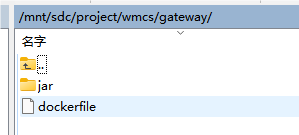

# 1、运行环境


```javascript
version : '3.3'
services: 
  minio:
    container_name: minio
    image: minio/minio:latest
    privileged: true
    restart: always
    ports:
      - "9001:9001"
      - "9002:9002"
    volumes:
      - ./minio/data:/data
    environment:
      - MINIO_ROOT_USER=minio
      - MINIO_ROOT_PASSWORD=ER34ty56&*
    command: server /data --address ":9001" --console-address ":9002"
  influxdb:
    image: influxdb:1.8
    container_name: influxdb
    restart: always
    environment:
      - INFLUXDB_DB=warndata
      - INFLUXDB_ADMIN_ENABLED=true
      - INFLUXDB_ADMIN_USER=wmcs
      - INFLUXDB_ADMIN_PASSWORD=jckj@666888
    volumes:
      - TZ=Asia/Shanghai 
      - ./influxdb/conf:/etc/influxdb  
      - ./influxdb/data:/var/lib/influxdb/data
      - ./influxdb/meta:/var/lib/influxdb/meta
      - ./influxdb/wal:/var/lib/influxdb/wal
    ports:
      - 8083:8083
      - 8086:8086
    logging:
      driver: "json-file"
      options:
        max-size: "1g"

```

# 2、发布nacos，管理各服务的配置


```javascript
version : '3.7'
services:
  nacos:
    image: nacos/nacos-server:v2.3.0
    container_name: nacos
    privileged: true
    restart: always
    ports:
      - "8848:8848"
      - "9848:9848"
      - "9849:9849"
    volumes:
      - ./nacos/conf/application.properties:/home/nacos/conf/application.properties
    environment:
      - MODE=standalone
      - NACOS_AUTH_ENABLE=true
    logging:
      driver: "json-file"
      options:
        max-size: "500M"

```

# 3、编辑业务执行脚本


```javascript
version : '3.3'
services:
  gateway:
    container_name: gateway
    build:
      context: ./gateway
      dockerfile: dockerfile
    ports:
      - "9000:19000"
  auth:
    container_name: auth
    build:
      context: ./auth
      dockerfile: dockerfile
    ports:
      - "9100:9100"
  modules-file:
    container_name: modules-file
    build:
      context: ./modules/file
      dockerfile: dockerfile
    ports:
      - "9200:9200"
    volumes:
        - ./uploadPath:/home/uploadPath
  modules-system:
    container_name: modules-system
    build:
      context: ./modules/system
      dockerfile: dockerfile
    ports:
      - "9300:9300"
  modules-business:
    container_name: modules-business
    build:
      context: ./modules/business
      dockerfile: dockerfile
    ports:
      - "9400:9400"
  modules-workflow:
    container_name: modules-workflow
    build:
      context: ./modules/workflow
      dockerfile: dockerfile
    ports:
      - "9500:9500"


```

# 4、编译打包项目中的业务包

wmcs-service下获取各业务jar包。包含：


```null
网关服务包：
/jc-city-manage/jc-modules-base/jc-gateway/target/jc-gateway-1.0.jar 
文件服务包：
/jc-city-manage/jc-modules-base/jc-modules-file/target/jc-modules-file-1.0.jar
运维基础包：
/jc-city-manage/jc-modules-base/jc-modules-system/target/jc-modules-system-1.0.jar
文明城市业务核心包：
/jc-city-manage/jc-modules-business/jc-modules-civilization/target/jc-modules-civilization-1.0.jar
文明城市工作流核心包：
/jc-city-manage/jc-modules-business/jc-modules-workflow/target/jc-modules-workflow-1.0.jar
文明城市大屏接口服务包：
/jc-city-manage/jc-modules-business/jc-modules-screen/target/jc-modules-screen-1.0.jar
文明城市数据同步服务包：
/jc-city-manage/jc-modules-business/jc-modules-sync/target/jc-modules-sync-1.0.jar
文明城市任务服务包：
/jc-city-manage/jc-modules-business/jc-modules-task/target/jc-modules-task-1.0.jar

AI分析服务包： 
/jc-modules-topic/target/jc-modules-topic-1.0-SNAPSHOT.jar


```

# 5、将第四步编译打包后的服务拷贝至第三步的脚本对应的文件夹内

5.1 网关服务dockerfile

将jc-gateway-1.0.jar重命名为gateway.jar 放入同目录的jar文件夹下


```null
# 基础镜像
FROM  openjdk:8-jre
# author
MAINTAINER wmcs

# 挂载目录
VOLUME /home/wmcs
# 创建目录
RUN mkdir -p /home/wmcs
# 指定路径
WORKDIR /home/wmcs
# 复制jar文件到路径
COPY ./jar/gateway.jar /home/wmcs/app.jar
# 启动认证服务
ENV PARAMS="--server.port=9000 --spring.profiles.active=dev --jccloud.nacos.server-addr=xxx.xxx.x.xx:8848 --jccloud.nacos.namespace=civilization"

ENTRYPOINT ["/bin/sh","-c","java -Xms256m -Xmx512m -Dfile.encoding=utf8 -jar app.jar ${PARAMS}"]


```

5.2 文件服务dockerfile

将jc-modules-file-1.0.jar重命名为modules-file.jar 放入同目录的jar文件夹下


```null
# 基础镜像
FROM  openjdk:8-jre
# author
MAINTAINER wmcs

# 挂载目录
VOLUME /home/wmcs
# 创建目录
RUN mkdir -p /home/wmcs
# 指定路径
WORKDIR /home/wmcs
# 复制jar文件到路径
COPY ./jar/modules-file.jar /home/wmcs/app.jar
# 启动认证服务
ENV PARAMS="--server.port=9200  --spring.profiles.active=dev --jccloud.nacos.server-addr=xxx.xxx.x.xx:8848 --jccloud.nacos.namespace=civilization --jccloud.nacos.username=nacos --jccloud.nacos.password=nacos"

ENTRYPOINT ["/bin/sh","-c","java -Xms256m -Xmx512m -Dfile.encoding=utf8 -jar app.jar ${PARAMS}"]


```

5.3 运维基础服务dockerfile

将jc-modules-system-1.0.jar重命名为modules-system.jar 放入同目录的jar文件夹下


```null
# 基础镜像
FROM  openjdk:8-jre
# author
MAINTAINER wmcs

# 挂载目录
VOLUME /home/wmcs
# 创建目录
RUN mkdir -p /home/wmcs
# 指定路径
WORKDIR /home/wmcs
# 复制jar文件到路径
COPY ./jar/modules-system.jar /home/wmcs/app.jar
# 启动认证服务
ENV PARAMS="--server.port=9100  --spring.profiles.active=dev --jccloud.nacos.server-addr=xxx.xxx.x.xx:8848 --jccloud.nacos.namespace=civilization --jccloud.nacos.username=nacos --jccloud.nacos.password=nacos"

ENTRYPOINT ["/bin/sh","-c","java -Xms256m -Xmx512m -Dfile.encoding=utf8 -jar app.jar ${PARAMS}"]


```

5.4 业务核心服务dockerfile

将jc-modules-system-1.0.jar重命名为modules-system.jar 放入同目录的jar文件夹下


```null
# 基础镜像
FROM  openjdk:8-jre
# author
MAINTAINER wmcs

# 挂载目录
VOLUME /home/wmcs
# 创建目录
RUN mkdir -p /home/wmcs
# 指定路径
WORKDIR /home/wmcs
# 复制jar文件到路径
COPY ./jar/modules-business.jar /home/wmcs/app.jar
# 启动认证服务
ENV PARAMS="--server.port=9300  --spring.profiles.active=dev --jccloud.nacos.server-addr=xxx.xxx.x.xx:8848 --jccloud.nacos.namespace=civilization --jccloud.nacos.username=nacos --jccloud.nacos.password=nacos"

ENTRYPOINT ["/bin/sh","-c","java -Xms512m -Xmx512m -Dfile.encoding=utf8 -jar app.jar ${PARAMS}"]


```

5.4 工作流服务dockerfile

将jc-modules-workflow-1.0.jar重命名为modules-workflow.jar 放入同目录的jar文件夹下


```null
# 基础镜像
FROM  openjdk:8-jre
# author
MAINTAINER wmcs

# 挂载目录
VOLUME /home/wmcs
# 创建目录
RUN mkdir -p /home/wmcs
# 指定路径
WORKDIR /home/wmcs
# 复制jar文件到路径
COPY ./jar/modules-workflow.jar /home/wmcs/app.jar
# 启动认证服务
ENV PARAMS="--server.port=9400  --spring.profiles.active=dev --jccloud.nacos.server-addr=xxx.xxx.x.xx:8848 --jccloud.nacos.namespace=civilization --jccloud.nacos.username=nacos --jccloud.nacos.password=nacos"

ENTRYPOINT ["/bin/sh","-c","java -Xms512m -Xmx512m -Dfile.encoding=utf8 -jar app.jar ${PARAMS}"]


```

5.5 大屏服务dockerfile

将jc-modules-screen-1.0.jar重命名为modules-screen.jar 放入同目录的jar文件夹下


```null
# 基础镜像
FROM  openjdk:8-jre
# author
MAINTAINER wmcs

# 挂载目录
VOLUME /home/wmcs
# 创建目录
RUN mkdir -p /home/wmcs
# 指定路径
WORKDIR /home/wmcs
# 复制jar文件到路径
COPY ./jar/modules-screen.jar /home/wmcs/app.jar
# 启动认证服务
ENV PARAMS="--server.port=9500  --spring.profiles.active=dev --jccloud.nacos.server-addr=xxx.xxx.x.xx:8848 --jccloud.nacos.namespace=civilization --jccloud.nacos.username=nacos --jccloud.nacos.password=nacos"

ENTRYPOINT ["/bin/sh","-c","java -Xms512m -Xmx512m -Dfile.encoding=utf8 -jar app.jar ${PARAMS}"]


```

5.6 数据同步服务dockerfile

将jc-modules-sync-1.0.jar重命名为modules-sync.jar 放入同目录的jar文件夹下


```null
# 基础镜像
FROM  openjdk:8-jre
# author
MAINTAINER wmcs

# 挂载目录
VOLUME /home/wmcs
# 创建目录
RUN mkdir -p /home/wmcs
# 指定路径
WORKDIR /home/wmcs
# 复制jar文件到路径
COPY ./jar/modules-sync.jar /home/wmcs/app.jar
# 启动认证服务
ENV PARAMS="--server.port=9700  --spring.profiles.active=dev --jccloud.nacos.server-addr=xxx.xxx.x.xx:8848 --jccloud.nacos.namespace=civilization --jccloud.nacos.username=nacos --jccloud.nacos.password=nacos"

ENTRYPOINT ["/bin/sh","-c","java -Xms512m -Xmx512m -Dfile.encoding=utf8 -jar app.jar ${PARAMS}"]


```

5.7 任务服务dockerfile

将jc-modules-task-1.0.jar重命名为modules-task.jar 放入同目录的jar文件夹下


```null
# 基础镜像
FROM  openjdk:8-jre
# author
MAINTAINER wmcs

# 挂载目录
VOLUME /home/wmcs
# 创建目录
RUN mkdir -p /home/wmcs
# 指定路径
WORKDIR /home/wmcs
# 复制jar文件到路径
COPY ./jar/modules-task.jar /home/wmcs/app.jar
# 启动认证服务
ENV PARAMS="--server.port=9800  --spring.profiles.active=dev --jccloud.nacos.server-addr=xxx.xxx.x.xx:8848 --jccloud.nacos.namespace=civilization --jccloud.nacos.username=nacos --jccloud.nacos.password=nacos"

ENTRYPOINT ["/bin/sh","-c","java -Xms512m -Xmx512m -Dfile.encoding=utf8 -jar app.jar ${PARAMS}"]


```

5.8 AI分析的单独通过jar启动

在jar包同目录下执行命令即可


```null
nohup java -jar jc-modules-topic-1.0-SNAPSHOT.jar.jar > topic.log &


```

 停止服务可以如下操作：


```null
ps aux|grep jc-modules-topic-1.0-SNAPSHOT.jar.jar
查询到进程后，使用kill -9 杀死相对应的进程即可
kill -9 xxxx


```

# 6、启动应用服务

放好对应的应用包后检查各文件服务，启动docker-compse执行第三步的docker-compose脚本命令。


```javascript
docker-compose up -d

```

脚本如下：

restart.sh


```javascript
#!/bin/sh

echo '============================================================'
echo '重新构造容器...'

echo '============================================================'

IMAGES_NAME=$1

echo "停止镜像"
docker-compose stop $IMAGES_NAME
sleep 1
echo "移除当前镜像==> $IMAGES_NAME"
docker-compose rm -f $IMAGES_NAME
sleep 1


echo '============================================================'
echo "删除无效镜像======>"
docker rmi $(docker images | grep "none" | awk '{print $3}')
sleep 1
echo "building"
docker-compose build $IMAGES_NAME
sleep 1
echo "up-run"
docker-compose up -d $IMAGES_NAME


echo '============================================================'
echo "重启成功"
docker ps

```

可sh restart.sh 执行启动所有应用

也可以 sh restart.sh modules-system 启动其中一个应用容器

相关存放地址如图：





# 7、前端页面部署

应用环境nginx


```javascript
version: '2'
services:
  wmcs_nginx:
    container_name: wmcs_nginx
    image: nginx:1.24
    restart: always
    ports:
      - 20000:80
    environment:
      - TZ=Asia/Shanghai 
    volumes:
      - ./nginx/conf:/etc/nginx/conf.d 
      - ./nginx/logs:/var/log/nginx
      - ./nginx/html:/usr/share/nginx/html
      - ./nginx/wmcsHtml:/usr/share/nginx/wmcsHtml
      - ./nginx/cimHtml:/usr/share/nginx/cimHtml
      - ./nginx/wechatHtml:/usr/share/nginx/wechatHtml

```

conf.d 配置文件


```javascript
server {
    listen       80 default_server;
    listen       [::]:80 default_server;
    server_name  _;
    client_max_body_size 100M;
    root         /usr/share/nginx/html;    

    add_header 'Access-Control-Allow-Origin' '*';
    add_header 'Access-Control-Allow-Credentials' 'true';
    add_header Cache-Control private;
    add_header 'Access-Control-Allow-Methods' 'GET, POST, OPTIONS';
    add_header 'Access-Control-Allow-Headers' 'DNT,X-CustomHeader,Keep-Alive,User-Agent,X-Requested-With,If-Modified-Since,Cache-Control,Content-Type';

    location ^~ / {
        root   /usr/share/nginx/html/page;
        if (!-e $request_filename) {
            rewrite ^/(.*) /index.html last;
            break;
        }
        index  index.html index.htm;
    }


    location /map/ {
        root /usr/share/nginx/mapHtml;
        index index.html index.htm;
        autoindex on;
    }

    location /wmcs/ {
        root /usr/share/nginx/wmcsHtml;
        index index.html index.htm;
        autoindex on;
    }

    location /screen/ {
        root /usr/share/nginx/screenHtml;
        index index.html index.htm;
        autoindex on;
    }

    location /cim/ {
        root /usr/share/nginx/cimHtml;
        index index.html index.htm;
        autoindex on;
    }

    location /wechat/ {
        root /usr/share/nginx/wechatHtml;
        index index.html index.htm;
        autoindex on;
    }

    location /wechat/img/ {
        proxy_pass http://xxx.xxx.x.xx:9001/wmcs/;
    }

    location /img/ {
        proxy_pass http://xxx.xxx.x.xx:9001/;
    }

    location /prod-api/ {
        proxy_set_header Host $http_host;
        proxy_set_header X-Real-IP $remote_addr;
        proxy_set_header REMOTE-HOST $remote_addr;
        proxy_set_header X-Forwarded-For $proxy_add_x_forwarded_for;
        proxy_pass http://xxx.xxx.x.xx:9000/;
        proxy_connect_timeout 60s;
        proxy_send_timeout 180s;
        proxy_read_timeout 300s;
    }

    error_page 404 /404.html;
        location = /40x.html {
    }

    error_page 500 502 503 504 /50x.html;
        location = /50x.html {
    }
}

```

/nginx/html   主业务前端页面

/nginx/wmcsHtml   大屏页面

/nginx/cimHtml  CIM地图

/nginx/wechatHtml    微信页面

# 8、编译打包项目中的前端包

wmcs-web  主业务页面

进入文件夹使用npm install 安装插件包

使用npm run build 打包前端服务包。得到文件夹下dist地址。将内容替换至/nginx/html 

# 9、执行nginx 的docker-compose

在nginx的docker-compose同目录下执行命令启动nginx容器

docker-compose up -d


